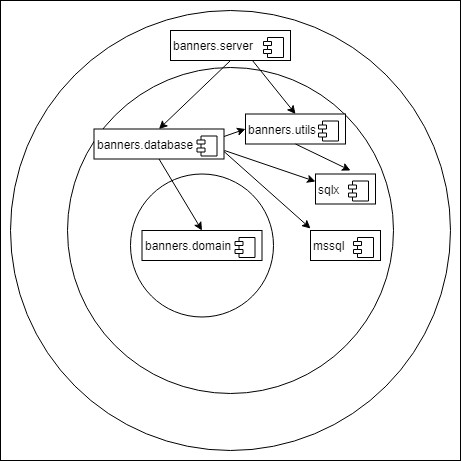

# banners.server
Repository for Go and Echo experimentation

The goal of this PoC is to set up an endpoint that allows to fetch data from a local database (MSSQL).

It is composed of four packages:

  - banners.server -> package main
    
    This package contains the Main() function.
    In here the Echo framework set up the endpoint specifying the route value and the the query parameters.
    
    '''/cms/banners/?language=?;pageId=?;deviceId=?'''
    
    In the enpoint.go file is possible to specify if a new dataset should not be created by commenting out the 
    database.Seed() instruction.
    
    This package contains also a test called endpoint_test.go which test the correctness of the GetBanners() function.
  
  - banners.database -> package database
  
    This package contains all database-related functions, along with the query.go file where the queries are stored.
  
  - banners.domain -> package domain
  
    This package contains all domain-specific structs. It doesn't depend on any package
  
  - banners.utils -> package utils
  
    This package contains all custom generic tasks functions used in code

The dependencies of this packages are arrenged as in figure:

Dependencies point to the center of the circle, where the high-level policies resides.
